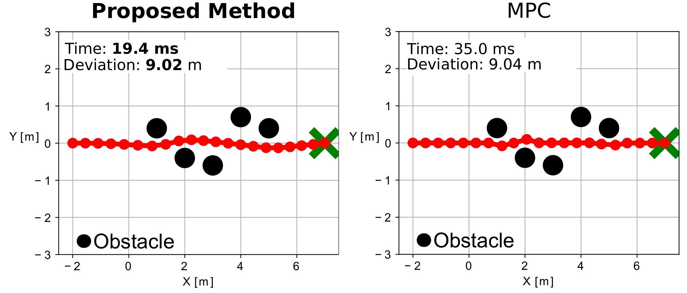
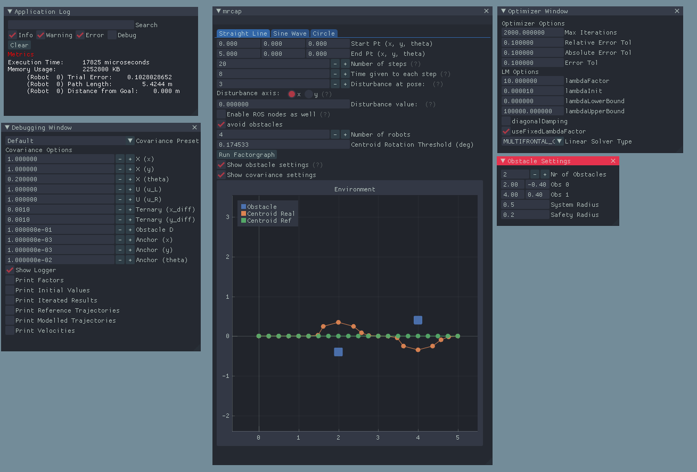
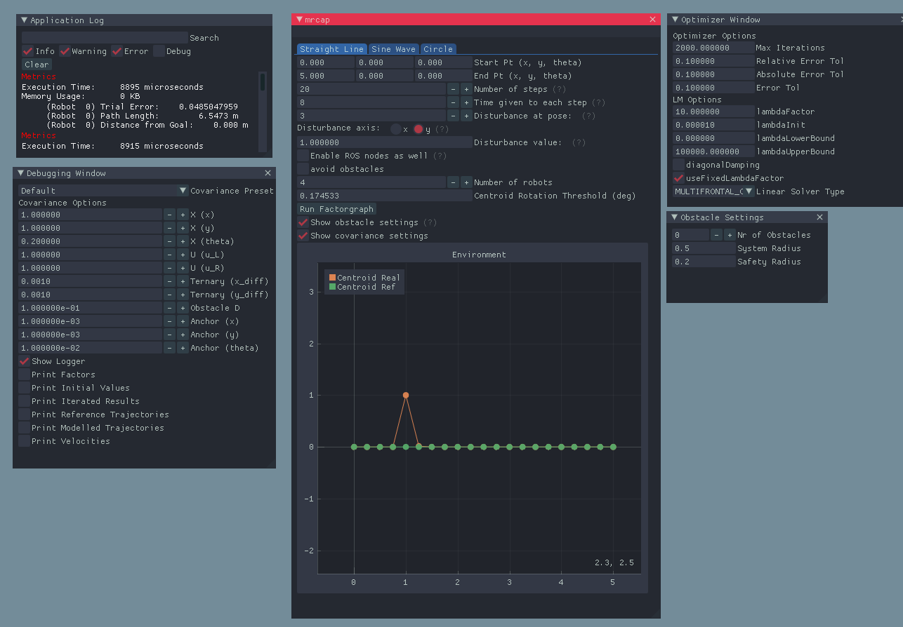
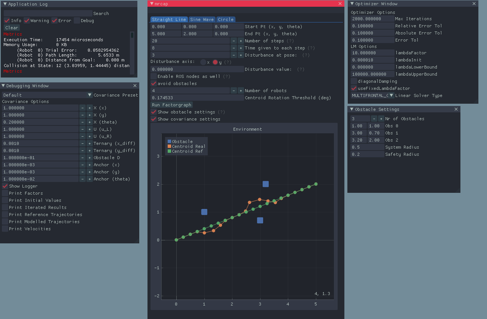
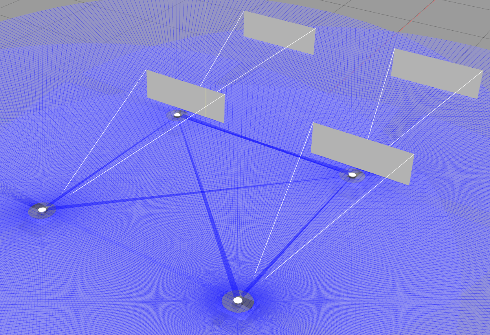
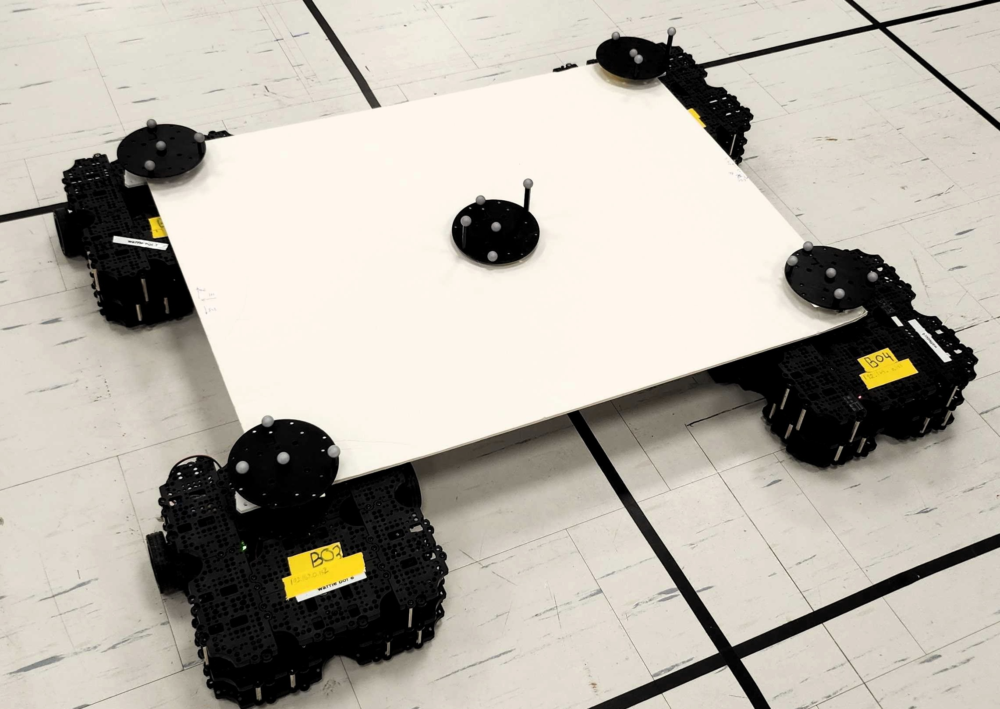

<!-- Improved compatibility of back to top link: See: https://github.com/othneildrew/Best-README-Template/pull/73 -->
<a name="readme-top"></a>
<!--
*** Thanks for checking out the Best-README-Template. If you have a suggestion
*** that would make this better, please fork the repo and create a pull request
*** or simply open an issue with the tag "enhancement".
*** Don't forget to give the project a star!
*** Thanks again! Now go create something AMAZING! :D
-->


<!-- PROJECT SHIELDS -->
<!--
*** I'm using markdown "reference style" links for readability.
*** Reference links are enclosed in brackets [ ] instead of parentheses ( ).
*** See the bottom of this document for the declaration of the reference variables
*** for contributors-url, forks-url, etc. This is an optional, concise syntax you may use.
*** https://www.markdownguide.org/basic-syntax/#reference-style-links
-->
<div align="center">

[![Contributors][contributors-shield]][contributors-url]
[![Forks][forks-shield]][forks-url]
[![Stargazers][stars-shield]][stars-url]
[![Issues][issues-shield]][issues-url]
[![MIT License][license-shield]][license-url]
[![LinkedIn][linkedin-shield]][linkedin-url]
</div>


<!-- PROJECT LOGO -->
<br />
<div align="center">
  <a href="https://github.com/h2jaafar/mr.cap">
    
  </a>

<h3 align="center">MR.CAP: Multi-robot Joint Control and Planning for Object Transport</h3>

  <p align="center">
    MR.CAP, or Multi-robot Joint Control and Planning for Object Transport, is a novel approach to solve simultaneous multi-robot control and planning problems. The algorithm is developed in C++, making use of factor graph inference and an innovative problem reduction to provide a robust, fast and scalable solution. Our approach outperforms state-of-the-art methods in terms of optimization time, scalability and robustness. The algorithm is tested in simulation and on a real robot system. The paper was accepted for publication in IEEE Control Systems Letters. See the website for more information.
    <br />
    <a href="https://github.com/h2jaafar/mr.cap/"><strong>Explore the docs »</strong></a>
    <br />
    <br />
    <a href="https://h2jaafar.github.io/projects/mrcap/">Website</a>
    ·
    <a href="https://github.com/h2jaafar/mr.cap/issues">Report Bug</a>
    ·
    <a href="https://github.com/h2jaafar/mr.cap/issues">Request Feature</a>
  </p>
</div>


<!-- TABLE OF CONTENTS -->
<details>
  <summary>Table of Contents</summary>
  <ol>
    <li>
      <a href="#about-the-project">About The Project</a>
      <ul>
        <li><a href="#built-with">Built With</a></li>
      </ul>
    </li>
    <li>
      <a href="#getting-started">Getting Started</a>
      <ul>
        <li><a href="#prerequisites">Prerequisites</a></li>
        <li><a href="#installation">Installation</a></li>
      </ul>
    </li>
    <li><a href="#usage">Usage</a></li>
    <li><a href="#roadmap">Roadmap</a></li>
    <li><a href="#contributing">Contributing</a></li>
    <li><a href="#license">License</a></li>
    <li><a href="#contact">Contact</a></li>
    <li><a href="#acknowledgments">Acknowledgments</a></li>
  </ol>
</details>


<!-- ABOUT THE PROJECT -->
## About The Project
<p align="center">

</p>
MR.CAP, or Multi-robot Joint Control and Planning for Object Transport, is a novel approach to solve simultaneous multi-robot control and planning problems. The algorithm is developed in C++, making use of factor graph inference and an innovative problem reduction to provide a robust, fast and scalable solution. Our approach outperforms state-of-the-art methods in terms of optimization time, scalability and robustness. The algorithm is tested in simulation and on a real robot system. The paper was accepted for publication in IEEE Control Systems Letters. See the website for more information.

This repository serves to provide the robotics community for a platform to test and develop the algorithm further, as well as to provide a platform for future research in the field of multi-robot control and planning. Our code is released as open source under the MIT license. We hope that this will help to accelerate the development of multi-robot systems and to provide a platform for future research in the field of multi-robot control and planning.

If you find this project useful, please give it a star! Thanks! If you use our code, please cite our paper:

```
to fill in
`
```

<p align="right">(<a href="#readme-top">back to top</a>)</p>


### Built With

* [![GTSAM][GTSAM]][https://gtsam.org/]
* [![CMake][CMake]][https://cmake.org/]
* [![Eigen][Eigen]][http://eigen.tuxfamily.org/]
* [![Boost][Boost]][https://www.boost.org/]
* [![ROS2][ROS2]][https://index.ros.org/doc/ros2/]


<p align="right">(<a href="#readme-top">back to top</a>)</p>


<!-- GETTING STARTED -->
## Getting Started

To setup the project locally, follow these simple steps. The demo will allow you to experiment with the algorithm and to test it on your own system.


### Prerequisites

First, ensure that you have installed GTSAM, and it's necessary prerequisites, as well as proper linking to the library. See [GTSAM](https://gtsam.org/) for more information.

First, navigate to a directory of your choice, and clone the GLEW and GTSAM repositories.

```
sudo apt-get install libglew-dev
sudo apt-get install libglfw3-dev
sudo apt install libxinerama-dev libxcursor-dev xinput libxi-dev 
git clone https://github.com/glfw/glfw
cd glfw
cmake -G "Unix Makefiles"
make
sudo make install
cd ..
```

```
git clone https://github.com/borglab/gtsam.git
cd gtsam
mkdir build && cd build
cmake -DGTSAM_ALLOW_DEPRECATED_SINCE_V42:=OFF .. # disable deprecated functionality for compatibility
make -j4 check # optional, run unit tests  
sudo make install
echo 'export LD_LIBRARY_PATH=/usr/local/lib:${LD_LIBRARY_PATH}' >> ~/.bashrc
echo 'export LD_LIBRARY_PATH=/usr/local/share:${LD_LIBRARY_PATH}' >> ~/.bashrc
source ~/.bashrc
```

### Installation

1. Clone the repo
   ```sh
   git clone https:://github.com/h2jaafar/mr.cap.git
   ```
2. Build the project
   ```sh
   cd mr.cap
   mkdir build && cd build
   cmake ..
   make
   ```
3. Run the demo
   ```sh
   ./mrcap_demo
   ```

<p align="right">(<a href="#readme-top">back to top</a>)</p>


<!-- USAGE EXAMPLES -->
## Usage

There are three ways to use the algorithm:
1. Pure C++ simulation (i.e non-physics based)
2. Gazebo simulation
3. Real robot system

To use the pure C++ simulation, simply run the demo as described above. This will run the algorithm on a simulated system, and launch a GUI using ImGui and ImPlot to visualize the results. 
<p align="center">

</p>


There are several configurable parameters in the demo. These are:
* Number of robots
* Number of obstacles
* Number of steps
* Start and goal positions of the centroid
* Robot geometry
* Optimization parameters
* Covariance parameters
* Psuedo-disturbances (for testing)
as well as many more, found in `include/mrcap/MainWindow.h`. We have tried to make as many of these parameters as possible configurable, to allow for easy experimentation, however, some of them may require some searching in the code to find. 

Some images of the demo are shown below:
<p align="center">


</p>


To use the Gazebo simulation, first install Gazebo and ROS2. I highly recommend using a custom ROS2 Gazebo world for multi-robot simulation I developed alongside this project. It can be found [here](https://github.com/h2jaafar/multiple-tb3-launcher). This will allow you to easily launch multiple robots in Gazebo, and to control them using ROS2.

<p align="center">

</p>


Finally, to use the algorithm on real robot systems is simply a matter of sim2real. Simply remap the topics to the real robot topics, and you're good to go! See `include/mrcap/ROSCommunications.h` for details regarding the topics subscribed and published to.

In our experimentation, we published robot velocites to `/B0n/cmd_vel` where `n` is the robot number. We used a Vicon motion capture system to obtain robot positions, and subscribe to the `/vicon/B0n/B0n` topics. You can simply substitute this with your localization stack of choice.

<p align="center">

</p>
<p align="right">(<a href="#readme-top">back to top</a>)</p>


<!-- ROADMAP -->
## Roadmap

- [x] Pure C++ simulation
- [x] Gazebo simulation
- [x] Real robot system
- [ ] Configuration files
- [ ] Unit tests

See the [open issues](https://github.com/h2jaafar/mr.cap/issues) for a full list of proposed features (and known issues).

<p align="right">(<a href="#readme-top">back to top</a>)</p>


<!-- CONTRIBUTING -->
## Contributing

Contributions are what make the open source community such an amazing place to learn, inspire, and create. Any contributions you make are **greatly appreciated**.

If you have a suggestion that would make this better, please fork the repo and create a pull request. You can also simply open an issue with the tag "enhancement".
Don't forget to give the project a star! Thanks again!

1. Fork the Project
2. Create your Feature Branch (`git checkout -b feature/AmazingFeature`)
3. Commit your Changes (`git commit -m 'Add some AmazingFeature'`)
4. Push to the Branch (`git push origin feature/AmazingFeature`)
5. Open a Pull Request

<p align="right">(<a href="#readme-top">back to top</a>)</p>


<!-- LICENSE -->
## License

Distributed under the MIT License. See `LICENSE.txt` for more information.

<p align="right">(<a href="#readme-top">back to top</a>)</p>


<!-- CONTACT -->
## Contact
Hussein Ali Jaafar - husseinali.jaafar@torontomu.ca

Project Link: [https://github.com/h2jaafar/mr.cap](https://github.com/h2jaafar/mr.cap)

<p align="right">(<a href="#readme-top">back to top</a>)</p>


<!-- ACKNOWLEDGMENTS -->
## Acknowledgments
Major thanks to my co-authors and supervisors for their help and support in this project. This project would not have been possible without them. Specifically Howard (Cheng-Hao) for the late nights helping debug. 
* [Cheng-Hao Kao](https://www.linkedin.com/in/cheng-hao-kao-64343b252/)

GTSAM and the GTSAM team for their amazing library and support.

* [GTSAM](https://gtsam.org/)

And of course, ROS and ROS2 for their amazing libraries and support.

* [ROS](https://www.ros.org/)

<p align="right">(<a href="#readme-top">back to top</a>)</p>


<!-- MARKDOWN LINKS & IMAGES -->
<!-- https://www.markdownguide.org/basic-syntax/#reference-style-links -->
[contributors-shield]: https://img.shields.io/github/contributors/h2jaafar/mr.cap.svg?style=for-the-badge
[contributors-url]: https://github.com/h2jaafar/mr.cap/graphs/contributors
[forks-shield]: https://img.shields.io/github/forks/h2jaafar/mr.cap.svg?style=for-the-badge
[forks-url]: https://github.com/h2jaafar/mr.cap/network/members
[stars-shield]: https://img.shields.io/github/stars/h2jaafar/mr.cap.svg?style=for-the-badge
[stars-url]: https://github.com/h2jaafar/mr.cap/stargazers
[issues-shield]: https://img.shields.io/github/issues/h2jaafar/mr.cap.svg?style=for-the-badge
[issues-url]: https://github.com/h2jaafar/mr.cap/issues
[license-shield]: https://img.shields.io/github/license/h2jaafar/mr.cap.svg?style=for-the-badge
[license-url]: https://github.com/h2jaafar/mr.cap/blob/master/LICENSE.txt
[linkedin-shield]: https://img.shields.io/badge/-LinkedIn-black.svg?style=for-the-badge&logo=linkedin&colorB=555
[linkedin-url]: https://linkedin.com/in/hussein-ali-jaafar
[ROS2]: https://img.shields.io/badge/ROS2-22314E?style=for-the-badge&logo=ros&logoColor=white
[GTSAM]: https://img.shields.io/badge/GTSAM-22314E?style=for-the-badge&logo=cpp&logoColor=white
[CMake]: https://img.shields.io/badge/CMake-22314E?style=for-the-badge&logo=cmake&logoColor=white
[Eigen]: https://img.shields.io/badge/Eigen-22314E?style=for-the-badge&logo=eigen&logoColor=white
[Boost]: https://img.shields.io/badge/Boost-22314E?style=for-the-badge&logo=boost&logoColor=white
